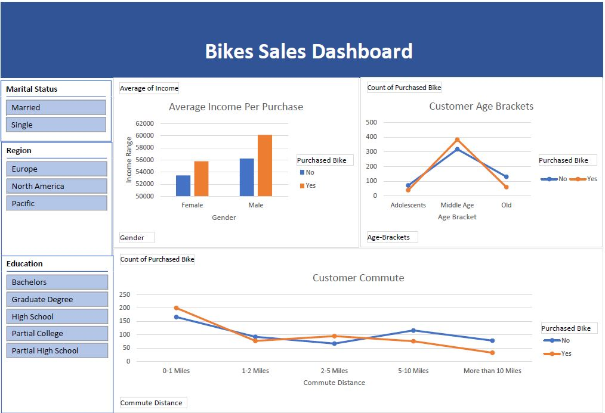

# EXCEL-DASHBOARD
DESCRIPTION

This repository contains an excel project that analyzes and visualizes bike sales data using Excel. The analysis includes trends and patterns in the data, as well as the creation of interactive charts and graphs to help understand and communicate the insights derived from the data all presented in a dashboard.

Description:

The dataset in file E-Commerce Dashboard dataset.xlsx contains sales data for different product categories. The following are the features in the dataset:
* gender
* Income
* Children
* Education
* Occupation
* Home Own
* Cars
* Commute Distance
* Region
* Age
* Purchased Bike

The following project tasks are required to be performed in Excel:

* Use the data of bike sales
* Prepare a pivot table of average income of gender
* prepare a pivot table of commute distance vs purchased bike
* prepare a pivot table of age bracket vs purchased bike
* Create slicers with respect to Marital Status, Region and Education

 

Expected Deliverables:  Design a sales dashboard that analyzes the sales based on individual average income, age,marital status, regionn, education and commute distance.
